# 📊 Telco Customer Churn Analysis

## 📘 Project Overview

This project analyzes customer churn behavior in a telecommunications company using a subset of real-world dataset. Applied advanced statistical and machine learning techniques—including PCA, MANOVA, logistic regression, clustering, and canonical correlation analysis—to uncover key patterns, reduce dimensionality, and build predictive models. The goal is to gain actionable insights for customer retention and business growth.

## 🧠 Research Questions

This project explores key questions about customer behavior in the telecommunications industry:

- What demographic, service, and financial features influence customer churn?
- Can techniques like PCA and factor analysis reduce dimensionality while retaining meaningful patterns?
- Are there identifiable customer clusters based on service use, payments, and churn?
- How do churned and non-churned customers differ across multiple variables?

---

## 🧾 Dataset Description

- **Samples:** 200 customers  
- **Features:** 14 variables

| Feature               | Description |
|----------------------|-------------|
| Age                  | Customer's age |
| Senior Citizen       | Whether the customer is a senior |
| Married              | Marital status |
| Tenure in Months     | Months with the company |
| Monthly Charge       | Total monthly bill |
| Contract             | Contract type (e.g., month-to-month, one year) |
| Churn                | 1 = churned, 0 = not churned |
| Satisfaction Score   | Scale from 1 to 100 |
| Streaming TV/Music/Movies | Streaming service subscription |
| Internet Type        | DSL, Fiber optic, None |
| Under 30             | Whether the customer is under 30 |
| CLTV                 | Customer Lifetime Value |

The dataset was cleaned and normalized before analysis.  

  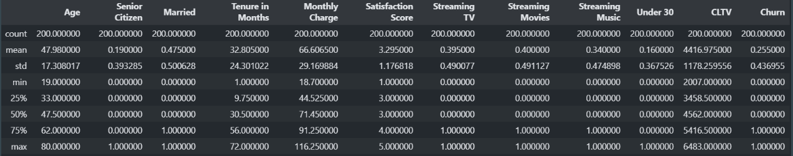

---

## 📈 Exploratory Data Analysis (EDA)

- Younger customers (<30) use streaming music more.  
  
  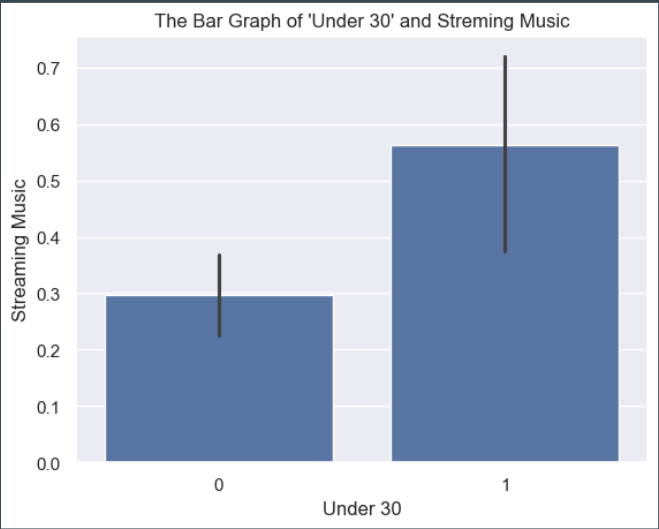

- CLTV and Monthly Charges show weak positive correlation (r ≈ 0.11).  
  
  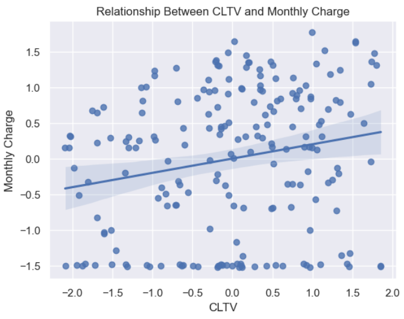

- Churn varies by age and internet type — highest among fiber users, lowest for no internet.  
  
  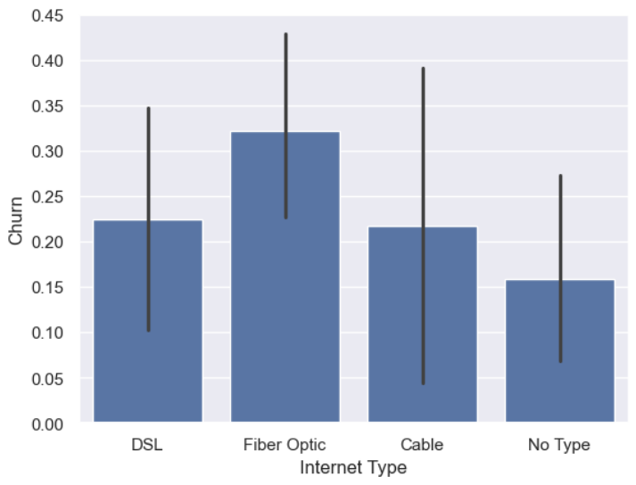

- Non-churned customers tend to pay more monthly. Both groups have similar ranges and outliers.  
  
  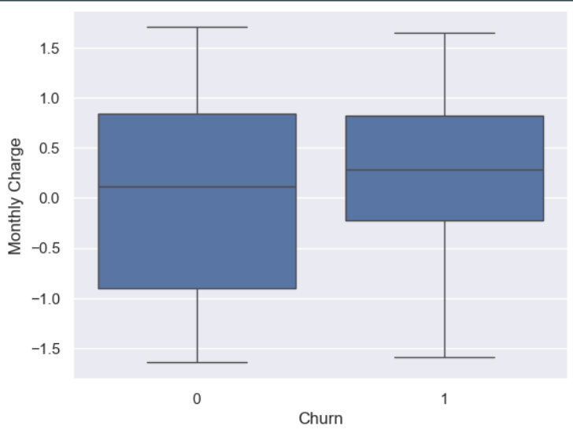

- Strong negative correlation between Satisfaction Score and Churn.  
  
  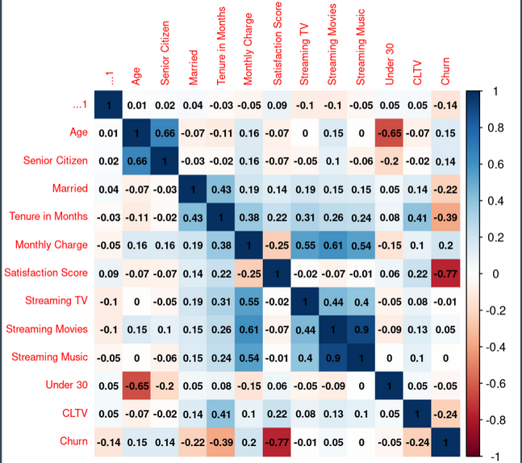

---

## 🧪 Multivariate Inference

- **Hotelling’s T² Test** and **MANOVA** both reject the null hypothesis.
- Indicates significant multivariate differences between churned and non-churned customers.  
  
  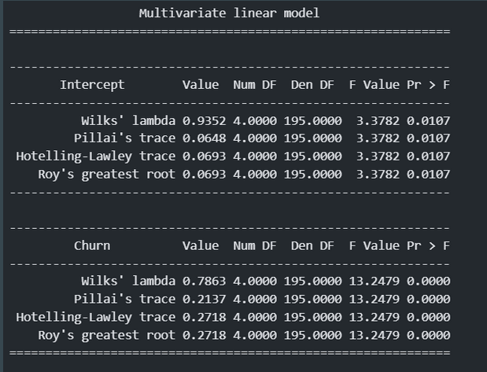

  
  

---

## 🔄 PCA & Principal Component Regression

- PCA applied after scaling.
- 4 components extracted; PC5 removed due to low variance contribution.  
  
  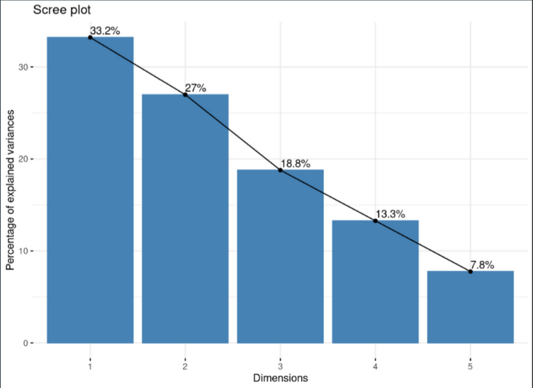

  
  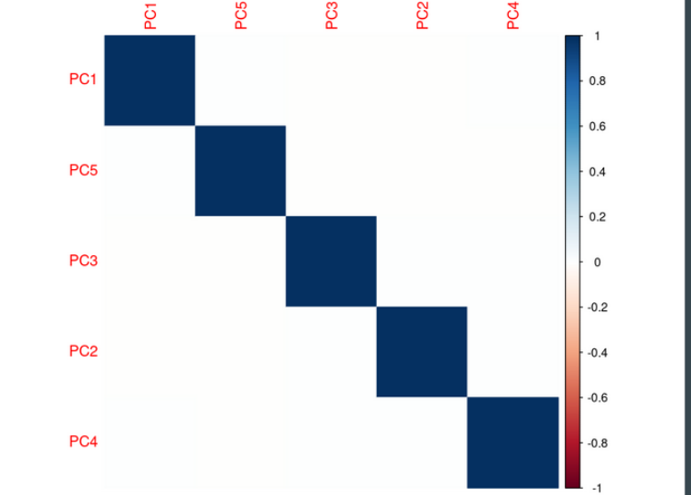

**Principal Component Regression (PCR)**:
- **MSE**: 0.06696  
- **RMSE**: 0.25876  
  
  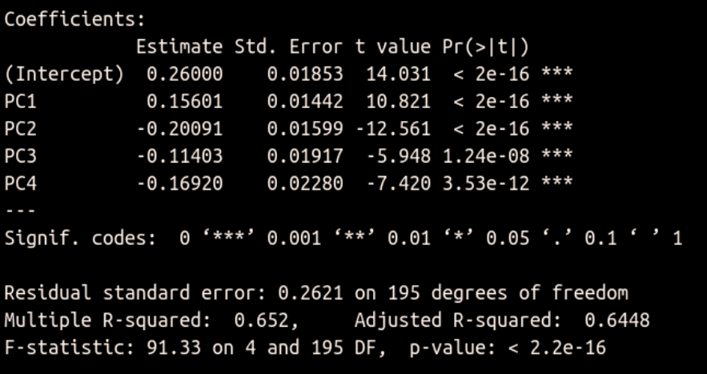

---

## 🧱 Factor Analysis

Factor analysis and rotations helped interpret hidden patterns among customer variables.  

  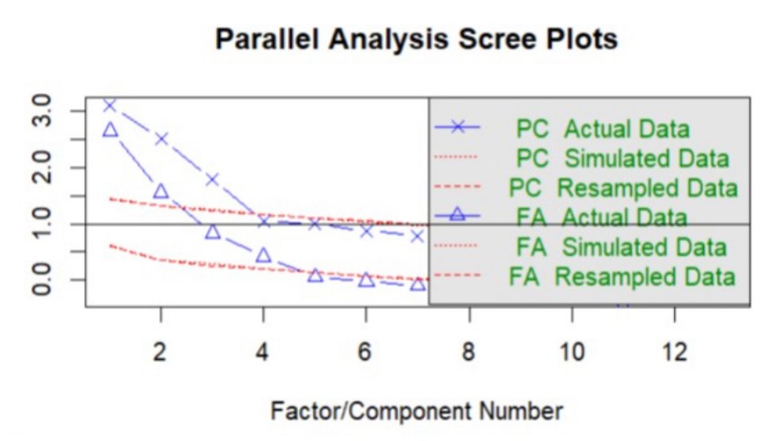

  

---

## 🤖 Classification & Discrimination

Several models were used for churn prediction:

| Model                  | Purpose |
|------------------------|---------|
| Logistic Regression    | Baseline classifier |
| Decision Tree          | Rule-based, interpretable |
| K-Nearest Neighbors    | Distance-based learning |
| LDA / QDA              | Effective class separation |

---

## 🧩 Clustering

- Unsupervised clustering revealed behavior-based customer segments.  
 
  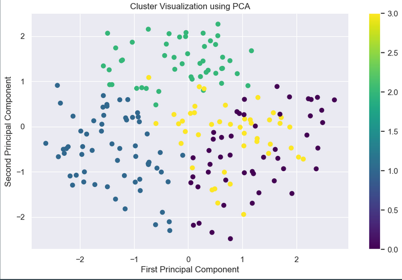

---

## 🔗 Canonical Correlation Analysis

- **Set 1**: Age, Senior, Married, Tenure  
- **Set 2**: Charges, Satisfaction, Streaming, CLTV

Examined multivariate correlation between demographic and financial-service features.  

  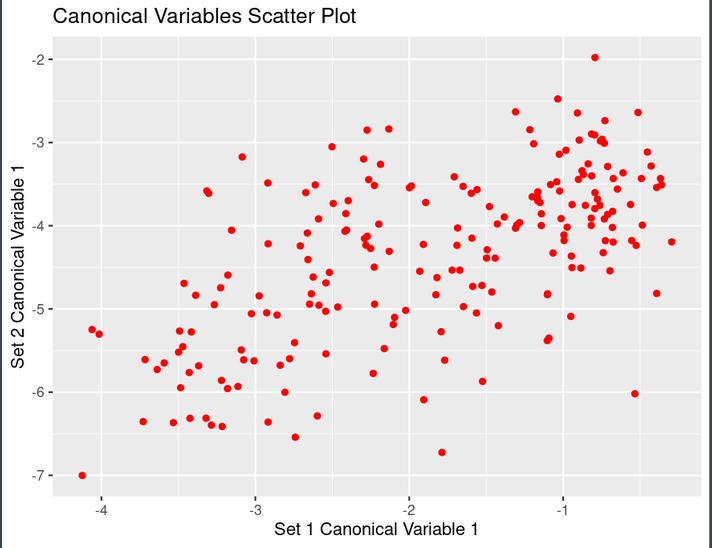

---

## 📌 Conclusion

- Churn shows strong negative correlation with Satisfaction and slight negative trend with Tenure.
- Streaming services increase revenue but don’t reduce churn directly.
- Longer contracts significantly boost CLTV—supporting long-term plans for retention.
- Machine learning models (LDA, QDA) performed well, offering practical strategies for churn prediction and customer segmentation.

---

